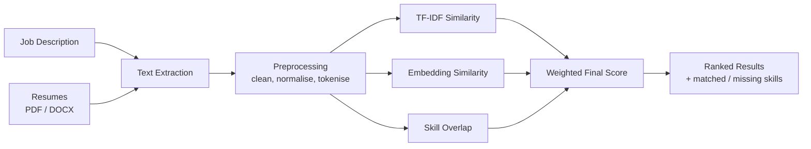

# ResumeRank AI

**Rank resumes against a job description in seconds, and see exactly which skills each candidate has and is missing.**

ResumeRank AI is a resume screening tool that takes a job description and a batch of resumes (PDF or DOCX), scores every resume for relevance, and returns a ranked list. It combines classic keyword matching (TF-IDF), semantic matching (text embeddings), and explicit skill overlap, so the ranking reflects both the exact words a recruiter cares about and the meaning behind them.

Built as a B.Tech Information Technology major project at Haldia Institute of Technology.

---

## Table of Contents

- [Features](#features)
- [How It Works](#how-it-works)
- [Scoring Explained](#scoring-explained)
- [Tech Stack](#tech-stack)
- [Project Structure](#project-structure)
- [Getting Started](#getting-started)
- [Using the App](#using-the-app)
- [API Reference](#api-reference)
- [Evaluation](#evaluation)
- [Known Limitations](#known-limitations)
- [Roadmap](#roadmap)
- [Author](#author)

---

## Features

- **Bulk upload**: drag and drop multiple resumes (PDF and DOCX) alongside a job description.
- **Hybrid ranking**: blends TF-IDF similarity, embedding-based semantic similarity, and skill overlap into one final score.
- **Recruiter-friendly output**: each candidate shows **matched skills** and **missing skills** as tags, so you can see *why* they ranked where they did.
- **Score breakdown on demand**: TF-IDF, embedding, and skill scores are tucked behind a "show scoring details" toggle.
- **Sortable results** with score bars and a **top-match** badge.
- **CSV export** of the ranked results.
- **FastAPI backend**: a single `/rank` endpoint you can call from the UI or any other client.
- **Measured, not guessed**: evaluated locally against a hand-labelled ground truth using Spearman correlation and Precision@K.
- **Dockerised**: ships with a `Dockerfile` for one-command setup.

---

## How It Works



1. **Input**: the user provides one job description and one or more resumes.
2. **Text extraction**: raw text is pulled out of each PDF or DOCX file.
3. **Preprocessing**: text is cleaned and normalised (lowercasing, removing noise, tokenising) so that formatting differences do not affect scoring.
4. **Feature extraction and scoring**: each resume is compared with the job description in three ways (see below).
5. **Ranking**: the three scores are combined into a final score, resumes are sorted, and the API returns the ranked list with matched and missing skills.

---

## Scoring Explained

Each resume receives three component scores, each between 0 and 1:

| Component | What it measures | Strength | Weakness |
|---|---|---|---|
| **TF-IDF cosine similarity** | Overlap of important words between the resume and the JD | Rewards exact terminology; fast and transparent | Blind to synonyms and context |
| **Embedding cosine similarity** | Semantic closeness of the two texts | Understands meaning, not just words | Can be fuzzy on specific tools and technologies |
| **Skill overlap** | Fraction of the JD's required skills found in the resume | Directly explains the match; powers the matched/missing tags | Only counts skills it can recognise as keywords |

The final score is a weighted combination of the three:

```
final_score = 0.2 * tfidf_score + 0.3 * embedding_score + 0.5 * skill_overlap_score
```


Weights are defined in `scoring.py` and can be tuned.

---

## Tech Stack

| Layer | Technology |
|---|---|
| Language | Python |
| API | FastAPI, Uvicorn |
| Text extraction | <!-- e.g. pdfplumber / PyPDF2, python-docx --> |
| Keyword features | scikit-learn (TF-IDF, cosine similarity) |
| Semantic features | <!-- e.g. sentence-transformers, model name --> |
| Frontend | HTML, CSS, JavaScript (dark theme, drag-and-drop) |
| Evaluation | pandas, SciPy (Spearman), custom Precision@K (run locally) |
| Packaging | Docker |
| Testing | pytest |

---

## Project Structure

```
ResumeRank-AI/
├── app/                   # FastAPI backend
│   ├── main.py            # App entry point and /rank endpoint
│   ├── ...                # Text extraction, preprocessing, scoring (incl. get_matched_skills())
├── static/                # Frontend (drag-and-drop UI)
├── data/
│   └── job_descriptions/  # Sample job descriptions
├── tests/                 # Automated tests
├── Dockerfile
├── .dockerignore
├── .gitignore
├── requirements.txt
└── README.md
```

---

## Getting Started

### Prerequisites

- Python 3.10 or newer
- `pip`

### Installation

```bash
# 1. Clone the repository
git clone https://github.com/<aditya-03-raj>/<resumerank-ai>.git
cd <resumerank-ai>

# 2. Create and activate a virtual environment
python -m venv venv
source venv/bin/activate        # Windows: venv\Scripts\activate

# 3. Install dependencies
pip install -r requirements.txt
```

### Run the server

```bash
uvicorn app.main:app --reload
```

The API will be available at `http://127.0.0.1:8000`, and interactive docs at `http://127.0.0.1:8000/docs`.

### Run with Docker

```bash
docker build -t resumerank-ai .
docker run -p 8000:8000 resumerank-ai
```

Then open `http://localhost:8000`, which redirects to the app.

### Run the tests

```bash
pytest
```

---

## Using the App

1. Open the frontend in your browser.
2. Paste or upload the **job description**.
3. Drag and drop the **resumes** (PDF or DOCX). Each file appears as a chip you can remove.
4. Click **Rank**.
5. Review the results:
   - The best candidate gets a **Top Match** badge.
   - Each row shows the final score and **matched / missing skill tags**.
   - Click **Show scoring details** to see the TF-IDF, embedding, and skill bars.
   - Sort the table by any column, or **Export CSV**.

---

## API Reference

### `POST /rank`

Ranks uploaded resumes against a job description.

**Request** (`multipart/form-data`)

| Field | Type | Description |
|---|---|---|
| `job_description` | text | The job description |
| `resumes` | file(s) | One or more PDF / DOCX resumes |

**Example**

```bash
curl -X POST "http://127.0.0.1:8000/rank" \
  -F "job_description=Looking for an ML intern with Python, scikit-learn and SQL..." \
  -F "resumes=@resume_01.pdf" \
  -F "resumes=@resume_02.docx"
```

**Response** (illustrative; match this to your real schema)

```json
{
  "results": [
    {
      "rank": 1,
      "filename": "resume_02.docx",
      "final_score": 0.81,
      "tfidf_score": 0.74,
      "embedding_score": 0.86,
      "skill_overlap_score": 0.80,
      "matched_skills": ["python", "scikit-learn", "sql"],
      "missing_skills": ["docker"]
    }
  ]
}
```

---

## Evaluation

To check that the ranking is actually useful, the system was tested against a manually labelled ground truth.

**Setup**

- Job description: *ML Intern*
- 10 resumes ranked by hand to form a ground-truth ordering
- Resumes are a mix of synthetic, LLM-generated resumes and one real resume
- Metrics: Spearman rank correlation and Precision@K, comparing the model's ranking with the hand-made one

> The evaluation script and ground-truth data are not included in this repository (the test resumes contain personal information and the labelling set is still being expanded). The results below are from my local runs.

**Results**

| Metric | Score | Meaning |
|---|---|---|
| **Spearman correlation** | **0.794** (p = 0.006) | The model's ordering strongly agrees with the human ordering |
| **Precision@5** | **1.00** | All 5 of the model's top picks are in the human top 5 |
| **Precision@3** | 0.33 | The exact top-3 order differs from the human one |

**Reading the results**

The system reliably separates strong candidates from weak ones (P@5 = 1.0), but it sometimes shuffles the order *within* the top group. See the next section for the cause.

---

## Known Limitations

- **Keyword-literal skill matching.** The skill overlap score only counts exact keyword matches. A resume that lists "Regression, Classification, Clustering" as bullet-point skills can outscore an equally capable resume that demonstrates the same abilities through sentences describing projects.
- **No credit for unnamed "nice-to-have" tech.** Technologies such as AWS or MLflow earn nothing if the job description never names them explicitly.
- **Small ground truth.** Evaluation currently uses one job description and 10 resumes, so the numbers show the system works but should not be read as a general benchmark.
- **Synthetic data.** Most test resumes are LLM-generated, which may be cleaner and more uniform than real-world resumes.

These were documented deliberately rather than "fixed" by tuning weights to a single small dataset, which would overfit and hide the real behaviour of the system.

---

## Roadmap

- [ ] Add a second job description and ground truth to test generalisation
- [ ] Improve skill matching with synonyms and phrase-level / semantic skill detection
- [x] Dockerise the app
- [ ] Add the evaluation script and an anonymised ground-truth set to the repo
- [ ] Deploy a public demo
- [ ] Support section-aware parsing (education, experience, projects)

---

## Author

**Aditya**
B.Tech Information Technology, Haldia Institute of Technology (2024-2028)

- GitHub: [@aditya-03-raj](https://github.com/aditya-03-raj)
- LinkedIn: https://www.linkedin.com/in/aditya-03-raj/

---

*If you found this project useful, consider giving it a star.*
